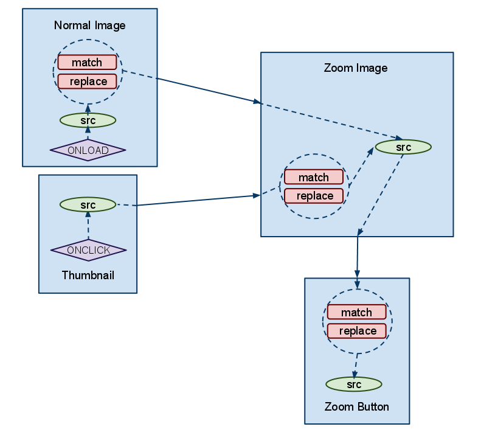

# Zoom Preview #

## Function ##

The zoom-preview widget provides a thumbnail button that when touched displays and translates the zoom-image.

Click [here](uranium/blob/master/examples/zoom_preview.html) for an example implementation (you'll need to download the repo to view the html).

## Setup ##

Below are the instructions for constructing the zoom-preview widget. You will also need to [group](uranium/blob/master/doc/model/grouping.md) these components.

### Required ###

#### Components ####

Add the 'data-ur-zoom-preview-component' attribute to all components:

Components:
##### Container #####
*  The 'container' component should contain the 'normal_image', 'zoom_image' and 'button' elements 
*  (it doesn't have to contain the thumbnails)
##### Normal_image #####
* This is the normal / hero image 
* This will be displayed when the zoom preview is not in use
#####  Zoom_image #####
* This is the giant image that the user scrolls when touching the button
* It should be set to a large version of the normal image (otherwise, its utility is lost)
##### Button #####
This is what the user touches/drags to show and move the zoom-image
##### Thumbnails #####
These are smaller versions of the hero image that when clicked update the normal image (by an external mechanism)

### Optional ###

#### States ####

Right now the button gets a 'loaded' class when the image has finished loading/been initialized --- this will soon change to a data-ur-state='loaded'

#### Custom Attributes ####

<!--

I think it would be simpler to have the zoom-image's modifiers expect the normal-image src as input by default.
I think the reason I did it this way is because the thumbnail elements can get rewritten (the elements, not their container) by third party js, which makes it hard to add the uranium attributes there.

-->

##### Button Modifier #####

This modifier operates on the incoming zoom-image src and the result gets applied to the button's src. Its recommended that you supply this modifier rule.

Set data-ur-src-modifier-match to the regex to be applied to the zoom-image src.
Set data-ur-src-modifier-replace to the value to apply to the regex match, the result of which will rewrite the button's src.

##### Zoom Image Modifer #####

This modifier operates on the incoming thumbnail src and the result gets applied to the zoom-image's src. 

Set data-ur-src-modifier-match to the regex to be applied to the thumbnail src.
Set data-ur-src-modifier-replace to the value to apply to the regex match, the result of which will rewrite the zoom-image's src.

##### Normal Image Modifier ######

This modifier operates on the normal-image's src and the result gets applied to the zoom-image's src. This modifier is different from the others in that it doesn't rewrite the src of the element that the rules are on - it rewrites the zoom-image's src instead.

Its highly recommended that you supply this modifier rule (the only other way to make the zoom-image apparently bigger than the normal image is if the normal image is actually large, but has a set width/height that is smaller than its natural dimensions --- but this isn't recommended, because it causes a slow paint of the image).

Set data-ur-src-modifier-match to the regex to be applied to the normal-image src.
Set data-ur-src-modifier-replace to the value to apply to the regex match, the result of which will rewrite the zoom-image's src.
